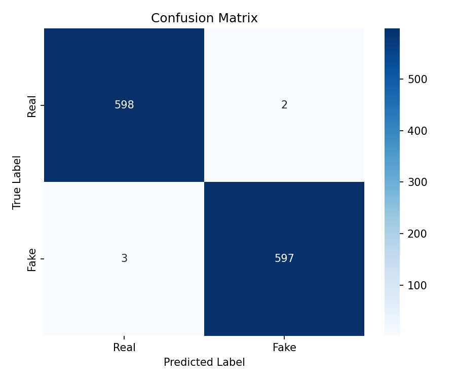

# 🎙️ Deepfake Audio Detection

A deep learning system to classify speech recordings as **Genuine (Human)** or **Deepfake (AI-Generated)** using a CNN trained on Mel-spectrogram features.

---

## 📊 Model Performance

| Metric | Score | Threshold |
|--------|-------|-----------|
| Accuracy | 99.58% | ≥ 80% ✅ |
| F1 Score | 99.58% | ≥ 80% ✅ |
| EER | 0.50% | ≤ 12% ✅ |
| Real Audio Accuracy | 99.67% | ≥ 75% ✅ |
| Fake Audio Accuracy | 99.50% | ≥ 75% ✅ |

---

## 🏗️ Pipeline

```
Raw Audio (.wav)
      ↓
Preprocessing (16kHz, mono, 2s window, normalization)
      ↓
Feature Extraction (Mel-spectrogram: 64 mels)
      ↓
CNN Model (3 Conv blocks + FC layers)
      ↓
Binary Classification: Genuine / Deepfake
      ↓
Confidence Score
```

---

## 🧠 Model Architecture

- **Input:** Mel-spectrogram (1 × 64 × 63)
- **Block 1:** Conv2d(1→32) + BatchNorm + ReLU + MaxPool
- **Block 2:** Conv2d(32→64) + BatchNorm + ReLU + MaxPool
- **Block 3:** Conv2d(64→128) + BatchNorm + ReLU + AdaptiveAvgPool(4×4)
- **Classifier:** Linear(2048→256) + ReLU + Dropout(0.4) + Linear(256→1)
- **Total Parameters:** 617,921
- **Loss:** BCEWithLogitsLoss
- **Optimizer:** Adam (lr=1e-3)
- **Scheduler:** StepLR (step=5, gamma=0.5)
- **Epochs:** 20

---

## 📦 Dataset

- **Primary:** [Fake-or-Real (FoR) Dataset](https://kaggle.com/datasets/mohammedabdeldayem/the-fake-or-real-dataset)
- **Subset used:** `for-2sec` — 2-second normalized clips
- **Training samples:** 3000 genuine + 3000 fake (balanced)
- **Train/Test split:** 80/20

---

## 🗂️ Project Structure

```
deepfake-audio/
├── models/
│   ├── deepfake_audio_model.pt   # trained model weights
│   └── model_config.json         # model configuration
├── data/                         # place dataset here for retraining
├── features/                     # extracted features cache
├── app.py                        # Streamlit web app
├── predict.py                    # inference script
├── train_pipeline.py             # training script
├── notebook.ipynb                # full reproducible pipeline
├── requirements.txt              # pinned dependencies
└── README.md
```

---

## 🚀 Setup & Installation

```bash
git clone https://github.com/Sarina-ux/deepfake-audio.git
cd deepfake-audio
pip install -r requirements.txt
```

---

## 🖥️ Run the Web App

```bash
streamlit run app.py
```

Then open `http://localhost:8501` in your browser.

---

## 🔍 Run Inference

**Single file:**
```bash
python predict.py --input path/to/audio.wav
```

**Batch CSV:**
```bash
python predict.py --input files.csv
```

CSV format:
```
filepath
audio/sample1.wav
audio/sample2.wav
```

---

## 🔁 Retrain the Model

1. Download the dataset from [Kaggle](https://kaggle.com/datasets/mohammedabdeldayem/the-fake-or-real-dataset)
2. Place `real/` and `fake/` folders inside `data/`
3. Run:

```bash
python train_pipeline.py
```

---

## 🌐 Live Demo

👉 [Deployed Streamlit App](https://sarina-ux-deepfake-audio-app-vuqjwo.streamlit.app/)

---

## 🎥 Demo Video

👉https://drive.google.com/file/d/1ywPvzGlogsZa7lidXJ0kBPx1mVG5iEcu/view?usp=sharing

---

## 🛠️ Tech Stack

| Tool | Purpose |
|------|---------|
| PyTorch | Model training and inference |
| Librosa | Audio loading and feature extraction |
| Streamlit | Web application |
| Scikit-learn | Evaluation metrics |
| Scipy | EER computation |
| Matplotlib / Seaborn | Confusion matrix visualization |

---

## 🔬 Feature Engineering

Audio files are converted to **Mel-spectrograms** — a 2D time-frequency representation that captures how energy is distributed across frequencies over time. This is ideal for detecting artifacts introduced by TTS (Text-to-Speech) and voice cloning systems.

- Sample rate: 16,000 Hz
- Mel bands: 64
- Duration: 2 seconds per clip
- Frequency range: 0–8,000 Hz
- Normalization: min-max per spectrogram

---

## 📉 Confusion Matrix



Only **5 misclassifications out of 1,200 test samples.**

---

*MARS Open Projects 2026 | Models and Robotics Section*
